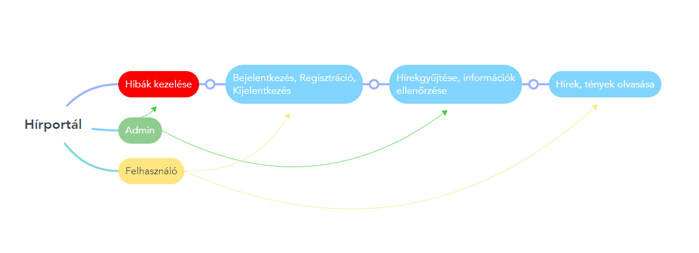
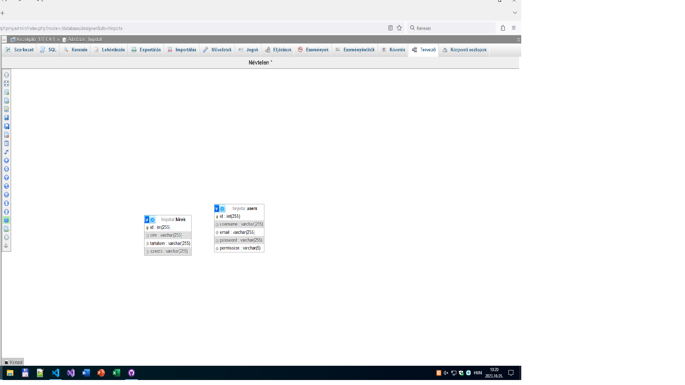

# Rendszerterv
## 1. A rendszer célja
A felhasználó hiteles és aktuális hírekről kapjon részletes információkat, mindezt átláthatóan és kidolgozottan. Bármilyen eszköről és böngészőből elérhető webalkalmazás. A hírek tipusok szerint csoportosítva is megtekinthető. Admin jogosultságú felhasználóknak lehetőségük van hírek létrehozására és törlésére.

## 2. Projektterv

### 2.1 Projektszerepkörök, felelőségek:
   * Scrum masters: Karácsony Balázs  
   * Product owner: Tajti Tibor
   * Üzleti szereplő: Tajti Tibor
     
### 2.2 Projektmunkások és felelőségek:
   * Frontend: Jaczina Norbert, Pál Joci
   * Backend: Kinczel Ádám
   * Tesztelés: Nagy Kristóf
     
### 2.3 Ütemterv:

|Funkció                  | Feladat                                | Prioritás | Becslés (nap) | Aktuális becslés (nap) | Eltelt idő (nap) | Becsült idő (nap) |
|-------------------------|----------------------------------------|-----------|---------------|------------------------|------------------|---------------------|
|Követelmény specifikáció |Megírás                                 |         1 |             1 |                      1 |                1 |                   1 |             
|Funkcionális specifikáció|Megírás                                 |         1 |             1 |                      1 |                1 |                   1 |
|Rendszerterv             |Megírás                                 |         1 |             1 |                      1 |                1 |                   1 |
|Program                  |Képernyőtervek elkészítése              |         2 |             1 |                      1 |                1 |                   1 |
|Program                  |Prototípus elkészítése                  |         3 |             8 |                      8 |                8 |                   8 |
|Program                  |Alapfunkciók elkészítése                |         3 |             8 |                      8 |                8 |                   8 |
|Program                  |Tesztelés                               |         4 |             2 |                      2 |                2 |                   2 |

### 2.4 Mérföldkövek:
   * Projekt megtervezése
   * Prototípus átadása
   * Kész projekt átadása

## 3. Üzleti folyamatok modellje


### 3.1 Üzleti szereplők

### 3.2 Üzleti folyamatok

## 4. Követelmények
 - Reszponzív, dinamikus weboldal
 - Felhasználókezelő rendszer
 - Backend része PHP legyen

### Funkcionális követelmények

| ID | Megnevezés | Leírás |
| --- | --- | --- |
| K1 | Regisztráció  | Felhasználói fiók létrehozására való opció.<br>Fióknélkül ne lehessen kommentelni. |
| K2 | Bejelentkezés | A korábban már regisztrált felhasználók be tudjanak jelentkezni az oldalra|
| K3 | Szerepkörök  | Felhasználók elkülönülnek jogosultságaik szerint |
| K4 | Komment |  Felhasználó leírthatja a gondolatait |
| K5 | CRUD műveletek |  Hír létrehozzása,törlése,szerkesztése.|

### Nemfunkcionális követelmények

| ID | Megnevezés | Leírás |
| --- | --- | --- |
| K1 | Jogok | Elkülönüljön az admin a felhasználótól az elsőnek több hozzáférrése legyen a felhasználónak kevesebb |
| K2 | Átlátható felület | Könnyen kezelhető webes felület |
| K3 | Adatbázis |  Adatbázis  alkalmazása az oldal fontosabb adatainak tárolására |


### Támogatott eszközök
Windows,Linux,MacOS
## 5. Funkcionális terv

### 5.1 Rendszerszereplők
 - Admin
    - Teljes hozzáférés a rendszerhez
    - Felhasználó tevékenységek felügyelése
    - Felhasználók törlése
    - Hírek létrehozása, törlése

 - Felhasználó
    - Hírek megtekintése
    - Visszajelzések küldése

### 5.2 Menühierarchiák
 - Bejelentkezés
    - Bejelentkezés
    - Regisztráció

 - Kezdőlap
    - Friss Hírek
    - Belföldi Hírek
    - Külföldi hírek
    - Politika
    - Felhasználói adatok
       - Kijelentkezés

## 6. Fizikai környezet

### Fejlesztő eszközök
 - Xampp
 - Visual Studio Code

## 8. Architekturális terv

A szerveroldai funkciókat PHP-ban (Visual Studio Code) írjuk meg.
A Backend komunikál a MySQL adatbázissal.
A Frontend részén űrlaposan kezeltük az adatbázis műveleteit.
A Webalkalmazást böngészőn keresztül lehet elérni.

### Webszerver

Apache (Xampp-on keresztül)

### Adatbázis rendszer

MySQL (phpMyAdmin)

### A program elérése, kezelése

Webszerveren (Apache)

## 9. Adatbázis terv



```SQL
-- phpMyAdmin SQL Dump
-- version 5.2.1
-- https://www.phpmyadmin.net/
--
-- Gép: 127.0.0.1
-- Létrehozás ideje: 2023. Okt 05. 10:29
-- Kiszolgáló verziója: 10.4.28-MariaDB
-- PHP verzió: 8.2.4

SET SQL_MODE = "NO_AUTO_VALUE_ON_ZERO";
START TRANSACTION;
SET time_zone = "+00:00";


/*!40101 SET @OLD_CHARACTER_SET_CLIENT=@@CHARACTER_SET_CLIENT */;
/*!40101 SET @OLD_CHARACTER_SET_RESULTS=@@CHARACTER_SET_RESULTS */;
/*!40101 SET @OLD_COLLATION_CONNECTION=@@COLLATION_CONNECTION */;
/*!40101 SET NAMES utf8mb4 */;

--
-- Adatbázis: `hirpotal`
--

-- --------------------------------------------------------

--
-- Tábla szerkezet ehhez a táblához `hirek`
--

CREATE TABLE `hirek` (
  `id` int(255) NOT NULL,
  `cim` varchar(255) NOT NULL,
  `tartalom` varchar(255) NOT NULL,
  `szerzo` varchar(255) NOT NULL
) ENGINE=InnoDB DEFAULT CHARSET=utf8mb4 COLLATE=utf8mb4_general_ci;

-- --------------------------------------------------------

--
-- Tábla szerkezet ehhez a táblához `users`
--

CREATE TABLE `users` (
  `id` int(255) NOT NULL,
  `username` varchar(255) NOT NULL,
  `email` varchar(255) NOT NULL,
  `password` varchar(255) NOT NULL,
  `permission` varchar(5) NOT NULL
) ENGINE=InnoDB DEFAULT CHARSET=utf8mb4 COLLATE=utf8mb4_general_ci;

--
-- A tábla adatainak kiíratása `users`
--

INSERT INTO `users` (`id`, `username`, `email`, `password`, `permission`) VALUES
(5, 'kristof', 'NEMTUDOM@gmail.com', '39bb37cf36d3b29a9280d8a70a0eed42', 'user');

--
-- Indexek a kiírt táblákhoz
--

--
-- A tábla indexei `hirek`
--
ALTER TABLE `hirek`
  ADD PRIMARY KEY (`id`);

--
-- A tábla indexei `users`
--
ALTER TABLE `users`
  ADD PRIMARY KEY (`id`);

--
-- A kiírt táblák AUTO_INCREMENT értéke
--

--
-- AUTO_INCREMENT a táblához `hirek`
--
ALTER TABLE `hirek`
  MODIFY `id` int(255) NOT NULL AUTO_INCREMENT;

--
-- AUTO_INCREMENT a táblához `users`
--
ALTER TABLE `users`
  MODIFY `id` int(255) NOT NULL AUTO_INCREMENT, AUTO_INCREMENT=6;
COMMIT;

/*!40101 SET CHARACTER_SET_CLIENT=@OLD_CHARACTER_SET_CLIENT */;
/*!40101 SET CHARACTER_SET_RESULTS=@OLD_CHARACTER_SET_RESULTS */;
/*!40101 SET COLLATION_CONNECTION=@OLD_COLLATION_CONNECTION */;

```

## 10. Implementációs terv

A projektünket a következő programozási nyelveken fejlesszük: HTML, CSS, JS és PHP.   
A weboldal információinak jelentős részét MySQL adatbázisban tároljuk el.  
A könnyebb átláthatóság és kezelhetőség érdekében magyar változóneveket, mappaneveket, könyvtárneveket részesítjük előnyben.

## 11. Tesztterv

A tesztelés fő célja annak biztosítása, hogy a rendszer és annak elemei megfelelően működjenek és hűen tükrözzék az üzleti követelményeket.
A fejlesztési team minden egyes tagja részt vesz ebben a vizsgálatban. Minden tesztelési eredményt a csapattagok külön-külön dokumentumokban rögzítenek.

### Tesztesetek

 | Teszteset | Elvárt eredmény | 
 |-----------|-----------------| 
 | Hírek listázása a kezdőlapon | Az összes, a rendszerben tárolt hír megjelenik a kezdőoldalon. | 
 | Egy hír részletes megtekintése | A kiválasztott hír teljes tartalma, dátuma és szerzője megjelenik egy új oldalon. | 
 | Hír keresése a keresőmezőben | A megadott kulcsszó alapján a rendszer releváns találatokat jelenít meg. |
 | Komment hozzáadása a hírhez | A megadott komment sikeresen hozzáadódik a hírhez. |
 | Kommentelés név nélkül | A rendszer figyelmeztet, hogy a név megadása kötelező. |
 | Regisztráció nélküli hír beküldése | A rendszer figyelmeztet, hogy csak regisztrált felhasználók küldhetnek be híreket. |
 | Hír beküldése szöveg nélkül | A rendszer figyelmeztet, hogy a hír szövegének megadása kötelező. |  
 -
   További információ a tesztelés mappában.
   
## 12. Telepítési terv

A Xampp egy népszerű helyi kiszolgálói környezet, amely mind Windows, mind Linux rendszereken elérhető, így hírportálunk megvalósításához is ezt használjuk. A Xampp segítségével könnyedén futtathatunk webalkalmazásokat a saját gépünkön. Az alábbi lépések mutatják be, hogyan használható a Xampp a két operációs rendszeren:
 - Windows rendszeren:
 1. Másolja az alkalmazásához szükséges fájlokat a xampp\htdocs könyvtárba.
 2. Nyissa meg a Xampp vezérlőpultját és indítsa el az Apache és MySQL szolgáltatásokat.
 3. Nyisson meg egy böngészőt és írja be a címsorba: localhost. Ezen a címen tekintheti meg az alkalmazását.
 - Linux rendszeren:
 1. Az alkalmazás fájljait a /opt/lampp/htdocs könyvtárba kell helyezni.
 2. A terminálban adja ki a következő parancsot a Xampp szolgáltatások indításához: sudo /opt/lampp/lampp start.
 3. Egy böngésző segítségével látogasson el a localhost címre, ahol megtekintheti a futó alkalmazását.

## 13. Karbantartási terv

 1. Beérkező visszajelzések gyűjtése és kategorizálása:
 - Visszajelzési rendszer létrehozása: Egy email cím létrehozása kifejezetten a felhasználói visszajelzésekhez, pl. visszajelzes@hirportal.hu.
 - Kategorizálás: A beérkező visszajelzések kategorizálása működéssel és dizájnnal kapcsolatosan.
 2. Működéssel kapcsolatos visszajelzések:
 - Hibajegy: Minden működéssel kapcsolatos hiba bejegyzése egy hibakövető rendszerben.
 - Prioritizálás: A hibák súlyossága és hatása alapján prioritizálás.
 - Orvoslás: A súlyos hibákat azonnal orvosolni kell, míg a kisebbeket a következő karbantartási időszakban.
 3. Kinézet, dizájnnal kapcsolatos visszajelzések:
 - Vizualizációs jegy: Minden dizájnnal kapcsolatos visszajelzést jegyezzünk fel egy külön listában.
 - Értékelés: A tervező csapat hetente értékeli a beérkező visszajelzéseket.
 - Implementálás: A jóváhagyott dizájnváltoztatások bevezetése a következő frissítés során.
 4. Válasz a felhasználóknak:
 - Visszaigazolás: Minden beérkező visszajelzésre küldjünk automatikus visszaigazolást, amely megerősíti, hogy megkaptuk a jelzést.
 - Személyes válasz: Amint a hibát orvosoltuk vagy a javaslatot értékeltük, küldjünk személyes választ a felhasználónak az eredményről vagy a következő lépésekről.
 5. Értékelés és továbbfejlesztés:
 - Havi értékelés: Havonta egyszer értékeljük a beérkezett visszajelzéseket, és készítsünk jelentést a vezetőség számára.
 - Folyamatos fejlesztés: A rendszeres visszajelzések alapján továbbfejlesztjük a portált és a karbantartási folyamatokat.

